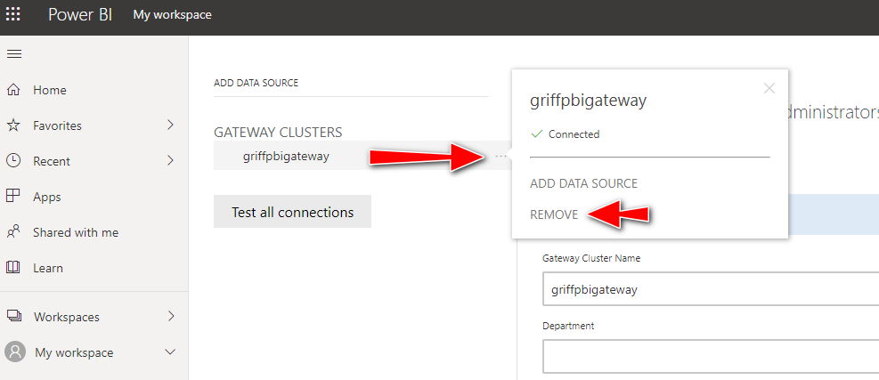

# Deploy a Power BI Gateway on an Azure VM

This project will create a new Windows Virtual Machine in Azure running the Power BI Gateway using Terraform.  The [Power BI Gateway](https://docs.microsoft.com/en-us/data-integration/gateway/service-gateway-onprem) is useful if your data is within a VNET and you want to expose it to Power BI.

The deployment is done using Terraform and a CustomScriptExtension with the included PowerShell scripts.  The scripts are deployed into Azure Storage as part of the overall deployment, where they are pulled down onto the newly provisioned virtual machine by the CustomScriptExtension and executed locally.  The scripts will install PowerShell 7 (a pre-requisite of the [Power BI Gateway PS Cmdlets](https://docs.microsoft.com/en-us/powershell/gateway/overview?view=datagateway-ps)), then install and configure the data gateway.  Logging of the Power BI Gateway deployment is done locally to log files and also surfaced back into Azure via the CustomScriptExtension.

## Developer Microsoft 365 Subscription

It is recommended that you use a development M365 tenant as a sandbox for this deployment.  You can get a free Microsoft 365 E5 developer subscription from here: https://developer.microsoft.com/en-us/microsoft-365/dev-program#Subscription.  You will need to associate this M365 tenant to either a new or existing Azure subscription, as this is needed to host the Azure VM that will be running the Power BI Gateway.  To change the directory of an existing Azure subscription, within the [Azure portal](https://portal.azure.com/), select 'change directory' then select your M365 tenant:


## AAD Application

You will also need an AAD Application registered with a secret to create the Power BI Gateway cluster:


This application will need the PBI Service permissions enabled:


Make a note of the AAD Application Id, secret and your Tenant Id.

## Development Container Deployment

Within VSCode, open the project within the dev container.  Add your AAD Application Id, Secret and Tenant to the variables.tf file.  You will want to ensure you add additional administrator(s)  to the Power BI Gateway Data Cluster so that you can manage it once it is created.  The `gateway_admin_ids` variable is a comma separated list of AAD User Object Ids (you can also use AAD Group Object Ids too) and the `gateway_region` parameter lets you override the Power BI Data Gateway region to use for your tenant.

```bash
az login
terraform init
terraform apply -auto-approve -var admin_password={YOUR-PASSWORD} -var gateway_name={YOUR-GATEWAY-NAME} -var gateway_recovery_key={YOUR-GATEWAY-RECOVERY-KEY} -var gateway_admin_ids={AAD-USER-OBJECT-ID-GUID} -var gateway_region={AZURE-DATA-CENTER}
```

> Note: If you encounter problems, see the [troubleshooting](#Troubleshooting) section for tips on fixing this.

## Power BI Data Gateway

Once the deployment is complete, login to the [Power BI portal](https://app.powerbi.com/) and check it exists under https://app.powerbi.com/groups/me/gateways:


## Removing the Power BI Data Gateway

The [pbiGatewayRemove.ps1](./scripts/pbiGatewayRemove.ps1) PowerShell script can be used to remove the gateway once it's been registered on the tenant.  This is useful if you're running the provisioning within a CI build and want to tear it down cleanly before removing the hosted VM.  Otherwise, you'll end up with an orphan gateway registration, which you'll need to remove manually in the Power BI portal - see [instructions below](#Gateway-not-created).  PowerShell has been configured within the dev container to execute this:

```bash
pwsh ./scripts/pbiGatewayRemove.ps1 -AppId {YOUR-AAD-APP-ID} -Secret {YOUR-AAD-APP-SECRET} -TenantId {YOUR-AAD-tenant-ID} -GatewayName {YOUR-GATEWAY-NAME}
```

## Troubleshooting

To troubleshoot any Power BI Gateway deployment or configuration errors, check the Azure VM Extensions status in the [Azure portal](https://portal.azure.com/):


An example of the output within the Azure VM Extension 'Detailed status' is available here: [CustomScriptExtension output](docs/gatewayinstall.json)

If this doesn't help, then remote desktop (RDP) onto the VM and check the logs in the following locations:

- C:\WindowsAzure\Logs\Plugins\Microsoft.Compute.CustomScriptExtension\1.10.9\CustomScriptHandler.log
- C:\WindowsAzure\Logs\Plugins\Microsoft.Compute.CustomScriptExtension\setup.log
- C:\WindowsAzure\Logs\Plugins\Microsoft.Compute.CustomScriptExtension\pbiGateway.log

An example of both the [setup.log](docs/setup.log) and [pbigateway.log](docs/pbiGateway.log) have also been included.

You can also check that the PowerShell script files have been successfully downloaded onto the VM in the following location:

- C:\Packages\Plugins\Microsoft.Compute.CustomScriptExtension\1.10.9\Downloads\0\
- C:\Packages\Plugins\Microsoft.Compute.CustomScriptExtension\1.10.9\Status\0.status

Lastly, look in Event Viewer under 'Applications and Services Logs' - 'On-premises data gateway service':


### Gateway admins not being added

You may find that when specifying additional gateway admins they are not applied - this will be appear in the log as "Warning! Data Gateway admin user not added". If this happens, you can re-run just the CustomScriptExtension again by tainting the Terraform resource:

`terraform taint azurerm_virtual_machine_extension.pbi_gateway_install`

Then apply the terraform again, this doesn't need to re-provision the VM again so won't take long, it will just execute the scripts within the CustomScriptExtension.

### Gateway not created

If the Power BI Data Gateway fails to be created, it maybe because one has already been provisioned with the same name.  You can try deleting the gateway manually in the portal by hovering over the cluster and moving your cursor to the right-hand side until three dots appear:



After clicking 'Remove', re-run the Terraform script.

> Note: If you've re-ran the Terraform script to simply add another user, you may need to sign out and back in again before the list of admins in the portal is updated.
